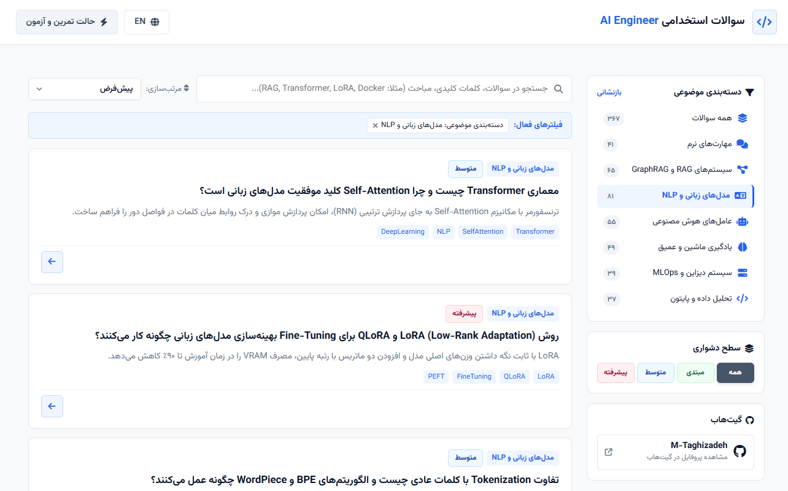

# AI Engineer Interview Questions & Preparation Platform

[](https://m-taghizadeh.github.io/ai-engineer-interview/)
[](https://github.com/M-Taghizadeh/ai-engineer-interview)
[](https://github.com/M-Taghizadeh/ai-engineer-interview)
[](https://github.com/M-Taghizadeh/ai-engineer-interview)
[](https://github.com/M-Taghizadeh/ai-engineer-interview)
[](LICENSE)

An open-source, bilingual (Persian & English), interactive interview preparation platform tailored for modern AI Engineers, LLM & RAG Developers, and MLOps Practitioners. Includes curated, unique technical and behavioral questions complete with detailed explanations, SVG conceptual diagrams, Python code snippets, and pro interview tips.

---

## Platform Preview



---

## Key Features

- **Exhaustive & Unique Questions**: 100% unique interview questions categorized into 7 core domains:
  - **Machine & Deep Learning**: Transformers, Loss Functions, Optimization, Backpropagation
  - **LLMs & Natural Language Processing**: Self-Attention, Tokenization, Fine-tuning, LoRA, QLoRA, DPO/RLHF
  - **RAG & GraphRAG Systems**: Vector DBs, Hybrid Search, Knowledge Graphs, Re-ranking
  - **AI Agents & Multi-Agent Frameworks**: ReAct, Planning, Tool Use, LangGraph, Autogen
  - **System Design & MLOps**: Model Serving, Docker, Model Monitoring, Latency Optimization
  - **Data Analysis & Python**: NumPy, PyTorch, Vectorization, Profiling
  - **Soft Skills & Behavioral**: Conflict Resolution, Cross-functional Communication, Failure Handling
- **Dynamic Bilingual Support**: Instant toggling between Persian (RTL) and English (LTR) with automatic font adaptations (Vazirmatn & Inter).
- **Real-time Search & Multi-filtering**: Client-side instant keyword search, difficulty filter chips (Beginner, Intermediate, Advanced), and category navigation.
- **Practice & Quiz Mode**: Interactive flashcard-style quiz mode for self-assessment.

---

## Tech Stack

- **Core**: Vanilla HTML5, CSS3, ES6 JavaScript
- **Icons & Visuals**: FontAwesome 6 (Vector Icons), Custom SVG graphics
- **Typography**: Vazirmatn (Persian), Inter (English)
- **Deployment**: GitHub Pages (100% Static Web Application)

---

## Quick Start & Local Development

No package installation or build process is required.

### Method 1: Direct File Opening
1. Clone the repository:
   ```bash
   git clone https://github.com/M-Taghizadeh/ai-engineer-interview.git
   cd ai-engineer-interview
   ```
2. Double-click `index.html` to open the application in any modern Web Browser.

### Method 2: Local HTTP Server (Python)
Run a lightweight local server:
```bash
python -m http.server 8085
```
Open your browser and navigate to: **`http://localhost:8085`**

---

## Author

Developed by **[M-Taghizadeh](https://github.com/M-Taghizadeh)**.

Feel free to open issues or submit pull requests to contribute new questions or features!

---

## License

This project is licensed under the [MIT License](LICENSE) - see the LICENSE file for details.
